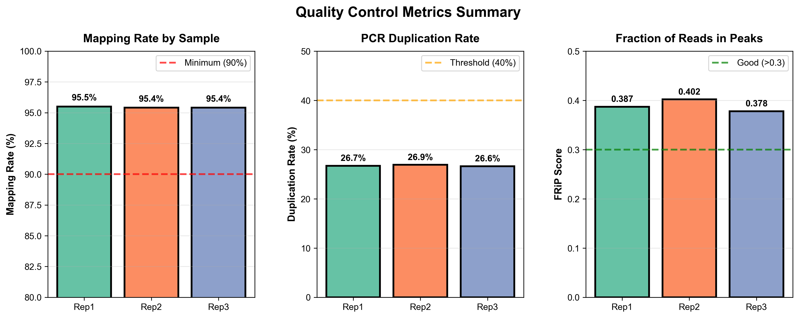

# ATAC-seq Analysis Pipeline

[](https://opensource.org/licenses/MIT)
[](https://www.gnu.org/software/bash/)
[](https://zenodo.org/)

A comprehensive, reproducible, and user-friendly pipeline for analyzing ATAC-seq (Assay for Transposase-Accessible Chromatin using sequencing) data from raw FASTQ files to publication-ready results.

## 📋 Table of Contents

- [Overview](#overview)
- [Features](#features)
- [Quick Start](#quick-start)
- [Requirements](#requirements)
- [Installation](#installation)
- [Usage](#usage)
- [Output Files](#output-files)
- [Quality Control Metrics](#quality-control-metrics)
- [Citation](#citation)
- [Contributing](#contributing)
- [License](#license)
- [Support](#support)

## 🔬 Overview

ATAC-seq is a method for mapping chromatin accessibility genome-wide. This pipeline automates the entire analysis workflow, from quality control of raw sequencing reads through peak calling, annotation, and visualization.

**What this pipeline does:**

1. ✅ Quality control of raw sequencing data
2. ✅ Adapter trimming and quality filtering
3. ✅ Alignment to reference genome
4. ✅ Removal of duplicates and mitochondrial reads
5. ✅ Peak calling (accessible chromatin regions)
6. ✅ Blacklist filtering
7. ✅ Peak annotation (genes, promoters, enhancers)
8. ✅ Generation of visualization tracks (BigWig)
9. ✅ Comprehensive quality metrics (FRiP scores)
10. ✅ Statistical summaries and publication-ready plots

## ✨ Features

- **🔄 Resume Capability**: Pipeline automatically resumes from the last completed step if interrupted
- **📊 Comprehensive QC**: Generates MultiQC reports at multiple stages
- **🎨 Publication-Ready Plots**: Automatically generates 15+ visualizations
- **📝 Full Reproducibility**: Logs all software versions, parameters, and checksums
- **🛡️ Error Handling**: Robust error checking and informative error messages
- **⚡ Optimized Performance**: Multi-threaded processing where possible
- **🧬 Genome Agnostic**: Works with any reference genome (configured for hg19 by default)
- **📈 Quality Metrics**: Calculates FRiP scores, TSS enrichment, fragment size distributions

## 🚀 Quick Start

```bash
# 1. Clone the repository
git clone https://github.com/yourusername/ATAC-seq-pipeline.git
cd ATAC-seq-pipeline

# 2. Install dependencies (see INSTALL.md for details)
bash scripts/install_dependencies.sh

# 3. Configure your analysis
cp config.example.sh config.sh
nano config.sh  # Edit with your paths

# 4. Run the pipeline
bash ATAC_main.sh

# Or submit to SLURM cluster
sbatch submit_ATAC.sh
```

## 📦 Requirements

### Software Requirements

| Tool | Minimum Version | Purpose |
|------|----------------|---------|
| Bash | 4.0+ | Pipeline execution |
| FastQC | 0.11.9+ | Quality control |
| Trim Galore | 0.6.0+ | Adapter trimming |
| Bowtie2 | 2.3.0+ | Read alignment |
| SAMtools | 1.10+ | BAM file processing |
| Picard | 2.20.0+ | Duplicate removal |
| Genrich | 0.6+ | Peak calling |
| BEDTools | 2.29.0+ | Genomic interval operations |
| deepTools | 3.3.0+ | BigWig generation and plotting |
| HOMER | 4.11+ | Peak annotation |
| featureCounts | 2.0.0+ | Read counting |
| MultiQC | 1.9+ | Report aggregation |
| R | 4.0.0+ | Statistical analysis and plotting |

**R packages**: ggplot2, dplyr, tidyr

### System Requirements

- **CPU**: 8+ cores recommended
- **RAM**: 32 GB minimum, 64 GB recommended
- **Storage**: ~500 GB per analysis (depends on data size)
- **OS**: Linux/Unix (tested on Ubuntu 20.04, CentOS 7)

See [INSTALL.md](INSTALL.md) for detailed installation instructions.

## 📥 Installation

For detailed installation instructions, see [INSTALL.md](INSTALL.md).

### Quick Installation (Ubuntu/Debian)

```bash
# Install via conda (recommended)
conda env create -f environment.yml
conda activate atac-seq

# Or use the automated installer
bash scripts/install_dependencies.sh
```

## 🔧 Usage

### Basic Usage

```bash
# Edit configuration
nano config.sh

# Run pipeline
bash ATAC_main.sh
```

### Advanced Usage

```bash
# Run on SLURM cluster
sbatch submit_ATAC.sh

# Resume interrupted run
bash ATAC_main.sh  # Automatically detects and resumes

# Clean previous run and start fresh
rm .pipeline_progress
bash ATAC_main.sh
```

For detailed usage instructions, see [USAGE.md](USAGE.md).

## 📂 Output Files

The pipeline generates the following directory structure:

```
ATAC-seq-analysis/
├── QC/                          # Quality control reports
│   ├── raw/                     # FastQC on raw reads
│   └── trimmed/                 # FastQC on trimmed reads
├── trimmed_data/                # Adapter-trimmed FASTQ files
├── alignment/                   # Aligned BAM files
│   └── dedup/                   # Deduplicated BAM files
├── peaks/                       # Called peaks
├── blacklist_removed/           # Filtered peaks
├── bigwig_tracks/               # Visualization tracks for IGV/UCSC
├── final_results/               # Main results
│   ├── pipeline_summary_stats.tsv
│   ├── ATAC_annotated_homer.txt
│   ├── counts.txt
│   └── frip/
├── plots/                       # All visualizations
│   ├── fragment_size_distribution.pdf
│   ├── TSS_enrichment_profile.pdf
│   ├── correlation_heatmap.pdf
│   └── ... (15+ plots)
├── multiqc_report/              # Integrated QC report
├── reproducibility_log.txt      # Software versions & parameters
└── command_log.txt              # All executed commands
```

### Key Output Files

| File | Description |
|------|-------------|
| `pipeline_summary_stats.tsv` | Main QC metrics for all samples |
| `ATAC_peaks.filtered.narrowPeak` | Final peak calls |
| `ATAC_annotated_homer.txt` | Peak annotations |
| `*.bw` | BigWig tracks for genome browser |
| `multiqc_report.html` | Interactive QC report |
| `frip_scores.txt` | FRiP scores for each sample |

See [USAGE.md](USAGE.md#output-files) for detailed descriptions of all output files.

## 📊 Quality Control Metrics

### Expected Quality Metrics

| Metric | Good | Acceptable | Poor |
|--------|------|------------|------|
| Mapping Rate | >95% | 85-95% | <85% |
| Duplication Rate | <20% | 20-40% | >40% |
| FRiP Score | >0.3 | 0.2-0.3 | <0.2 |
| Unique Peaks | >40,000 | 20,000-40,000 | <20,000 |
| TSS Enrichment | >7 | 5-7 | <5 |

### Example Output Plots

The pipeline generates publication-ready visualizations. Here are examples from GM12878 cells:

<p align="center">
  
  
</p>

<p align="center">
  
  
</p>

See the `test_output/` directory for complete example results:

- [Example summary statistics](test_output/example_summary_stats.tsv)
- [All example plots](test_output/example_plots/)
- [Plot interpretation guide](test_output/PLOT_GUIDE.md)

## 🧪 Test Data

Test your installation with the provided test dataset:

```bash
cd test_data/
bash run_test.sh
```

This will download a small ATAC-seq dataset and run the complete pipeline. Compare your results to `test_output/` to verify correct installation.

## 🔍 Troubleshooting

Common issues and solutions:

- **"Command not found" errors**: Ensure all dependencies are installed and in PATH
- **Memory errors**: Reduce thread count or increase available RAM
- **Alignment failures**: Check genome index paths in config.sh
- **No peaks called**: Check FRiP scores and library complexity

See [TROUBLESHOOTING.md](TROUBLESHOOTING.md) for detailed solutions.

## 📖 Documentation

- [INSTALL.md](INSTALL.md) - Detailed installation instructions
- [USAGE.md](USAGE.md) - Comprehensive usage guide
- [TROUBLESHOOTING.md](TROUBLESHOOTING.md) - Common problems and solutions
- [CHANGELOG.md](CHANGELOG.md) - Version history and updates

## 📚 Citation

If you use this pipeline in your research, please cite:

```bibtex
@software{atac_seq_pipeline,
  author = {Your Name},
  title = {ATAC-seq Analysis Pipeline},
  year = {2026},
  url = {https://github.com/yourusername/ATAC-seq-pipeline},
  version = {1.0.0}
}
```

And the tools used by this pipeline:

- **ATAC-seq method**: Buenrostro et al. (2013) Nature Methods
- **Genrich**: [GitHub](https://github.com/jsh58/Genrich)
- **HOMER**: Heinz et al. (2010) Molecular Cell
- See [CITATIONS.md](CITATIONS.md) for complete list

## 🤝 Contributing

Contributions are welcome! Please see [CONTRIBUTING.md](CONTRIBUTING.md) for guidelines.

## 📄 License

This project is licensed under the MIT License - see the [LICENSE](LICENSE) file for details.

## 💬 Support

- **Issues**: [GitHub Issues](https://github.com/yourusername/ATAC-seq-pipeline/issues)
- **Discussions**: [GitHub Discussions](https://github.com/yourusername/ATAC-seq-pipeline/discussions)
- **Email**: your.email@institution.edu

## 🙏 Acknowledgments

This pipeline was developed at [Your Institution]. We thank the developers of all the tools integrated into this pipeline.

---

**Keywords**: ATAC-seq, chromatin accessibility, epigenomics, NGS, bioinformatics, peak calling, genomics
