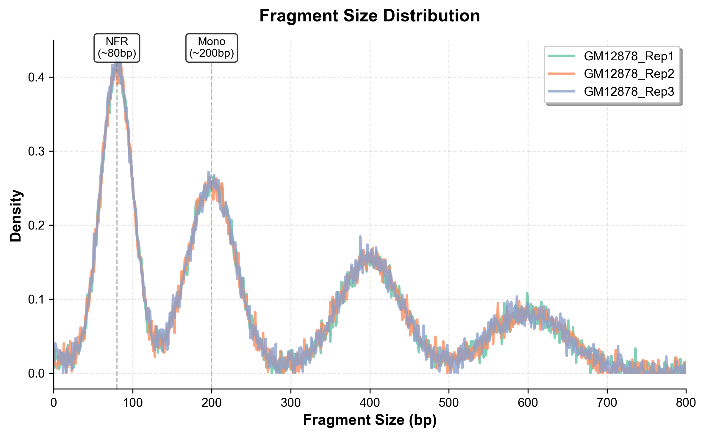
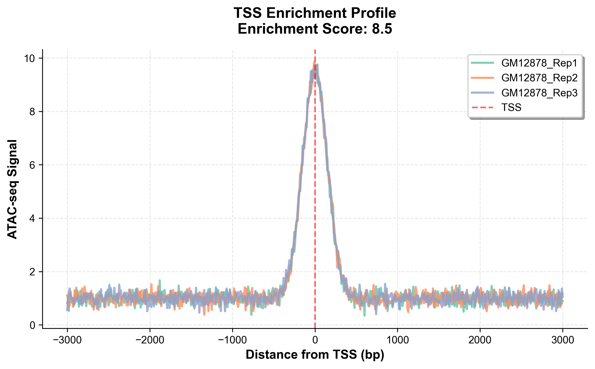
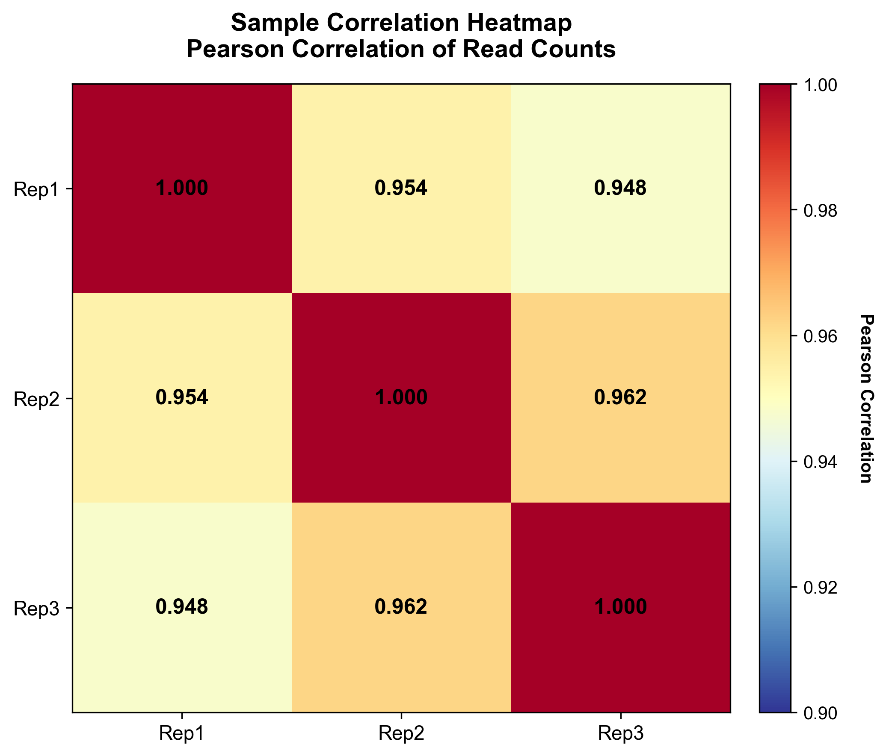

# Usage Guide

Comprehensive guide for running the ATAC-seq analysis pipeline.

## Table of Contents

- [Before You Start](#before-you-start)
- [Configuration](#configuration)
- [Running the Pipeline](#running-the-pipeline)
- [Understanding the Output](#understanding-the-output)
- [Quality Control Interpretation](#quality-control-interpretation)
- [Advanced Usage](#advanced-usage)
- [Frequently Asked Questions](#frequently-asked-questions)

## Before You Start

### Data Preparation

Your raw FASTQ files should be organized with the following naming convention:

```
SampleName_R1_001.fastq.gz  # Forward reads
SampleName_R2_001.fastq.gz  # Reverse reads
```

**Example:**
```
/path/to/raw_data/
├── Sample1_R1_001.fastq.gz
├── Sample1_R2_001.fastq.gz
├── Sample2_R1_001.fastq.gz
├── Sample2_R2_001.fastq.gz
├── Sample3_R1_001.fastq.gz
└── Sample3_R2_001.fastq.gz
```

### What You Need

1. ✅ Raw paired-end FASTQ files (gzipped)
2. ✅ Reference genome (FASTA) and Bowtie2 index
3. ✅ Blacklist regions BED file
4. ✅ Gene annotation files (RefSeq or GENCODE)
5. ✅ Sufficient disk space (500GB+ recommended)

## Configuration

### Step 1: Copy Configuration Template

```bash
cp config.example.sh config.sh
```

### Step 2: Edit Configuration File

Open `config.sh` in your favorite text editor:

```bash
nano config.sh
# or
vim config.sh
```

### Step 3: Set Required Parameters

```bash
#!/bin/bash

# ===== DIRECTORY CONFIGURATION =====

# Base directory for analysis output
BASE_DIR="/path/to/your/analysis/directory"

# Raw data directory (where your FASTQ files are)
RAW_DIR="/path/to/raw/fastq/files"

# ===== REFERENCE GENOME CONFIGURATION =====

# Path to Bowtie2 index (without file extension)
GENOME_INDEX="/path/to/bowtie2_index/hg19/hg19"

# Path to reference genome FASTA
GENOME_FA="/path/to/reference/hg19/hg19.fa"

# Path to blacklist regions BED file
BLACKLIST="/path/to/hg19-blacklist.bed"

# Path to annotation directory
ANNOTATION_DIR="/path/to/annotation/hg19/Genes"

# ===== COMPUTATIONAL PARAMETERS =====

# Number of threads/cores to use
THREADS=8

# Effective genome size for normalization
# hg19: 3137144693
# hg38: 3099750718
# mm10: 2652783500
EFFECTIVE_GENOME_SIZE=3137144693

# ===== OPTIONAL PARAMETERS =====

# Adapter sequence for trimming (Nextera default)
ADAPTER="CTGTCTCTTATA"

# Minimum insert size
MIN_INSERT=10

# Maximum insert size
MAX_INSERT=1000
```

### Parameter Descriptions

| Parameter | Description | Example |
|-----------|-------------|---------|
| `BASE_DIR` | Output directory for analysis | `/home/user/ATAC_analysis` |
| `RAW_DIR` | Input FASTQ directory | `/data/raw_fastq` |
| `GENOME_INDEX` | Bowtie2 index prefix | `/ref/hg19/bowtie2/hg19` |
| `GENOME_FA` | Genome FASTA file | `/ref/hg19/hg19.fa` |
| `BLACKLIST` | Blacklist BED file | `/ref/hg19-blacklist.bed` |
| `ANNOTATION_DIR` | Gene annotations | `/ref/hg19/Annotation/Genes` |
| `THREADS` | CPU cores to use | `8` (adjust to your system) |
| `EFFECTIVE_GENOME_SIZE` | For normalization | `3137144693` (hg19) |

## Running the Pipeline

### Option 1: Run Locally (Interactive)

For local computers or interactive sessions:

```bash
# Activate conda environment (if using conda)
conda activate atac-seq

# Run the pipeline
bash ATAC_main.sh
```

The pipeline will:
- Print progress messages for each step
- Create checkpoint files to enable resuming
- Generate logs in `reproducibility_log.txt` and `command_log.txt`

### Option 2: Run on SLURM Cluster

For HPC clusters with SLURM:

#### Step 1: Edit SLURM Script

Edit `submit_ATAC.sh`:

```bash
nano submit_ATAC.sh
```

Update these lines:

```bash
#SBATCH --job-name=ATAC_seq      # Job name
#SBATCH --partition=general      # Partition name
#SBATCH --nodes=1                # Number of nodes
#SBATCH --ntasks=1               # Number of tasks
#SBATCH --cpus-per-task=8        # CPUs per task
#SBATCH --mem=64G                # Memory
#SBATCH --time=48:00:00          # Time limit (HH:MM:SS)
#SBATCH --mail-type=ALL          # Email notifications
#SBATCH --mail-user=you@email.com
```

#### Step 2: Submit Job

```bash
sbatch submit_ATAC.sh
```

#### Step 3: Monitor Job

```bash
# Check job status
squeue -u $USER

# View output log
tail -f slurm-JOBID.out

# Check progress
cat .pipeline_progress
```

### Option 3: Run in Background (nohup)

For running on a server without SLURM:

```bash
nohup bash ATAC_main.sh > atac_pipeline.log 2>&1 &

# Monitor progress
tail -f atac_pipeline.log

# Check if still running
ps aux | grep ATAC_main.sh
```

### Resume Interrupted Run

If the pipeline is interrupted, simply run it again:

```bash
bash ATAC_main.sh
```

The pipeline will:
- Detect previous progress from `.pipeline_progress` file
- Skip completed steps
- Resume from the last incomplete step

To start completely fresh:

```bash
rm .pipeline_progress
bash ATAC_main.sh
```

## Understanding the Output

### Directory Structure

After completion, your analysis directory will contain:

```
your_analysis/
├── .pipeline_progress           # Checkpoint file (hidden)
├── command_log.txt              # All executed commands
├── reproducibility_log.txt      # Software versions & parameters
│
├── QC/                          # Quality control
│   ├── raw/                     # FastQC reports (raw data)
│   │   ├── Sample1_R1_001_fastqc.html
│   │   ├── Sample1_R1_001_fastqc.zip
│   │   └── ...
│   └── trimmed/                 # FastQC reports (trimmed data)
│
├── trimmed_data/                # Adapter-trimmed reads
│   ├── Sample1_R1_001_val_1.fq.gz
│   ├── Sample1_R2_001_val_2.fq.gz
│   └── ...
│
├── alignment/                   # Aligned reads
│   ├── Sample1.sorted.bam
│   ├── Sample1.sorted.bam.bai
│   └── dedup/                   # Deduplicated BAM files
│       ├── Sample1.dedup.bam
│       ├── Sample1.dedup.bam.bai
│       ├── Sample1.qnamesort.bam
│       └── Sample1_dup_metrics.txt
│
├── peaks/                       # Called peaks
│   └── ATAC_peaks.narrowPeak
│
├── blacklist_removed/           # Filtered peaks
│   └── ATAC_peaks.filtered.narrowPeak
│
├── bigwig_tracks/               # Genome browser tracks
│   ├── Sample1.bw
│   ├── Sample2.bw
│   └── Sample3.bw
│
├── final_results/               # Main results
│   ├── pipeline_summary_stats.tsv       # **KEY FILE**
│   ├── ATAC_annotated_homer.txt         # Peak annotations
│   ├── ATAC_peaks_genes_overlap.txt     # Peak-gene overlaps
│   ├── ATAC_peaks_closest_genes.txt     # Nearest genes
│   ├── peak_distribution_summary.txt    # Genomic distribution
│   ├── counts.txt                       # Read counts in peaks
│   └── frip/
│       └── frip_scores.txt              # FRiP scores
│
├── plots/                       # Visualizations
│   ├── fragment_size_distribution.pdf   # **IMPORTANT**
│   ├── TSS_enrichment_profile.pdf       # **IMPORTANT**
│   ├── correlation_heatmap.pdf          # **IMPORTANT**
│   ├── PCA_plot.pdf
│   ├── coverage_plot.pdf
│   ├── peak_distribution_barplot.pdf
│   ├── mapping_rate.pdf
│   ├── duplication_rate.pdf
│   └── ... (PNG versions also created)
│
└── multiqc_report/              # Integrated QC report
    └── multiqc_report.html              # **VIEW THIS FIRST**
```

### Key Output Files

#### 1. MultiQC Report (`multiqc_report/multiqc_report.html`)

**What it is**: Interactive HTML report summarizing all QC metrics

**How to use**: Open in web browser

**What to look for**:
- Overall quality scores
- Adapter contamination
- Sequence duplication levels
- GC content
- Read quality across cycles

#### 2. Summary Statistics Table (`final_results/pipeline_summary_stats.tsv`)

**Format**: Tab-separated values (open in Excel or text editor)

**Columns**:
- `Sample`: Sample name
- `Raw_Reads`: Number of raw reads
- `Trimmed_Reads`: Reads after trimming
- `Mapped_Reads`: Successfully aligned reads
- `Mapping_Rate(%)`: Alignment success rate
- `Reads_Before_Dedup`: Reads before removing duplicates
- `Reads_After_Dedup`: Unique reads
- `Duplication_Rate(%)`: PCR duplication percentage
- `FRiP`: Fraction of Reads in Peaks (quality metric)
- `Peaks`: Total peaks called

#### 3. Peak Files

**`peaks/ATAC_peaks.narrowPeak`**: Raw called peaks (before filtering)

**`blacklist_removed/ATAC_peaks.filtered.narrowPeak`**: Final peaks (**USE THIS**)

**Format**: BED-like format with 10 columns
```
chr1  1000  1500  peak_1  100  .  2.5  10.0  5.0  250
```
- Column 1: Chromosome
- Column 2: Start position
- Column 3: End position
- Column 4: Peak name
- Column 5: Score
- Column 7: Fold enrichment
- Column 8: -log10(p-value)
- Column 9: -log10(q-value)
- Column 10: Summit position (relative to start)

#### 4. Peak Annotations (`final_results/ATAC_annotated_homer.txt`)

**What it is**: Genomic context for each peak (promoter, exon, intron, intergenic, etc.)

**Key columns**:
- `PeakID`: Peak identifier
- `Chr`, `Start`, `End`: Genomic coordinates
- `Annotation`: Genomic feature (e.g., "promoter-TSS", "intron", "exon")
- `Gene Name`: Nearest gene
- `Distance to TSS`: Distance to transcription start site

#### 5. BigWig Tracks (`bigwig_tracks/*.bw`)

**What it is**: Normalized coverage tracks for genome browsers

**How to use**:
- Upload to UCSC Genome Browser
- Load in IGV (Integrative Genomics Viewer)
- Visualize chromatin accessibility across genome

#### 6. FRiP Scores (`final_results/frip/frip_scores.txt`)

**Format**: Tab-separated
```
Sample1  5000000  15000000  0.333
Sample2  6000000  16000000  0.375
```
- Column 1: Sample name
- Column 2: Reads in peaks
- Column 3: Total reads
- Column 4: FRiP score

**Interpretation**:
- FRiP > 0.3: Excellent
- FRiP 0.2-0.3: Good
- FRiP < 0.2: Poor (consider troubleshooting)

## Quality Control Interpretation

### Expected Metrics for Good ATAC-seq Data

| Metric | Excellent | Good | Acceptable | Poor |
|--------|-----------|------|------------|------|
| **Mapping Rate** | >95% | 90-95% | 85-90% | <85% |
| **Duplication Rate** | <15% | 15-25% | 25-40% | >40% |
| **FRiP Score** | >0.4 | 0.3-0.4 | 0.2-0.3 | <0.2 |
| **Total Peaks** | >50,000 | 30,000-50,000 | 20,000-30,000 | <20,000 |
| **TSS Enrichment** | >10 | 7-10 | 5-7 | <5 |
| **Library Complexity** | High | Medium | Low | Very Low |

### Fragment Size Distribution



**What to expect**:
- **Peak at ~50-100 bp**: Nucleosome-free regions (open chromatin)
- **Peak at ~200 bp**: Mononucleosomal fragments
- **Peaks at ~400, 600 bp**: Di-, tri-nucleosomal fragments

**Red flags**:
- Single broad peak: Degraded DNA
- No nucleosome-free peak: Failed ATAC-seq
- Very high peaks >1000 bp: Genomic DNA contamination

### TSS Enrichment



**What to expect**:
- Strong enrichment at TSS (transcription start sites)
- Sharp peak centered at position 0
- Enrichment score >7

**Red flags**:
- Flat profile: Poor targeting or failed experiment
- Low enrichment (<5): Library quality issues

### Sample Correlation



**What to expect**:
- Biological replicates: correlation >0.9
- Different conditions: correlation 0.7-0.9
- Technical replicates: correlation >0.95

**Red flags**:
- Replicates correlate poorly (<0.8): Sample quality or batch effects
- Samples cluster unexpectedly: Sample mix-up or batch effects

## Advanced Usage

### Analyzing Different Genomes

Edit configuration for other genomes:

```bash
# Mouse (mm10)
GENOME_INDEX="/ref/mm10/bowtie2/mm10"
GENOME_FA="/ref/mm10/mm10.fa"
BLACKLIST="/ref/mm10-blacklist.bed"
EFFECTIVE_GENOME_SIZE=2652783500

# Human hg38
GENOME_INDEX="/ref/hg38/bowtie2/hg38"
GENOME_FA="/ref/hg38/hg38.fa"
BLACKLIST="/ref/hg38-blacklist.bed"
EFFECTIVE_GENOME_SIZE=3099750718
```

### Running Single Samples

To analyze only specific samples, modify `ATAC_main.sh`:

```bash
# Original (processes all samples)
for sample in $RAW_DIR/*_R1_001.fastq.gz; do

# Modified (process only Sample1 and Sample2)
for sample in $RAW_DIR/Sample1_R1_001.fastq.gz $RAW_DIR/Sample2_R1_001.fastq.gz; do
```

### Custom Peak Calling

Modify Genrich parameters in `ATAC_main.sh`:

```bash
# Default (ATAC-seq mode, remove PCR duplicates)
Genrich -t ${DEDUP_DIR}/*.qnamesort.bam \
        -o $PEAK_DIR/ATAC_peaks.narrowPeak \
        -j -y -r -v -e chrM

# More stringent (q-value threshold)
Genrich -t ${DEDUP_DIR}/*.qnamesort.bam \
        -o $PEAK_DIR/ATAC_peaks.narrowPeak \
        -j -y -r -v -e chrM -q 0.01

# With control (background)
Genrich -t ${DEDUP_DIR}/treatment*.bam \
        -c ${DEDUP_DIR}/control*.bam \
        -o $PEAK_DIR/ATAC_peaks.narrowPeak \
        -j -r -v -e chrM
```

**Parameters**:
- `-j`: ATAC-seq mode
- `-y`: Keep duplicates in BAM (deprecated, don't use with -r)
- `-r`: Remove PCR duplicates
- `-v`: Verbose output
- `-e chrM`: Exclude mitochondrial chromosome
- `-q 0.05`: q-value threshold (default: 0.05)

### Parallel Processing

For large sample sets, modify thread allocation:

```bash
# In ATAC_main.sh, increase thread count for alignment
bowtie2 -p 16 ...  # Use 16 cores

# For BAM processing
samtools sort -@ 16 ...  # Use 16 cores

# For deepTools
bamCoverage --numberOfProcessors 16 ...
```

### Memory Optimization

For systems with limited RAM:

```bash
# Reduce samtools sort memory
samtools sort -m 2G ...  # 2GB per thread

# Process samples sequentially instead of parallel
# (already done by default in this pipeline)
```

## Downstream Analysis

### Differential Accessibility Analysis

Use the `counts.txt` file with DESeq2 in R:

```R
library(DESeq2)

# Read count matrix
counts <- read.table("final_results/counts.txt", header=TRUE, row.names=1)
counts <- counts[, 7:ncol(counts)]  # Remove annotation columns

# Create sample info
coldata <- data.frame(
  sample = colnames(counts),
  condition = c("Control", "Control", "Treatment", "Treatment")
)

# DESeq2 analysis
dds <- DESeqDataSetFromMatrix(countData = counts,
                               colData = coldata,
                               design = ~ condition)
dds <- DESeq(dds)
res <- results(dds)

# Significant peaks
sig_peaks <- subset(res, padj < 0.05 & abs(log2FoldChange) > 1)
```

### Motif Analysis

Find enriched transcription factor motifs in peaks:

```bash
# HOMER motif finding
findMotifsGenome.pl \
  blacklist_removed/ATAC_peaks.filtered.narrowPeak \
  hg19 \
  motif_output/ \
  -size 200 \
  -mask
```

### Footprinting Analysis

Identify transcription factor binding sites:

```bash
# Using TOBIAS
TOBIAS ATACorrect \
  --bam alignment/dedup/*.dedup.bam \
  --genome $GENOME_FA \
  --peaks blacklist_removed/ATAC_peaks.filtered.narrowPeak \
  --outdir footprints/

TOBIAS ScoreBigwig \
  --signal footprints/*_corrected.bw \
  --regions blacklist_removed/ATAC_peaks.filtered.narrowPeak \
  --output footprints/scores.bw

TOBIAS BINDetect \
  --motifs motifs.jaspar \
  --signals footprints/*_corrected.bw \
  --genome $GENOME_FA \
  --peaks blacklist_removed/ATAC_peaks.filtered.narrowPeak \
  --outdir bindetect/
```

## Frequently Asked Questions

### Q: How long does the pipeline take?

**A**: Depends on data size and system resources:
- Small dataset (3 samples, 20M reads each): 4-8 hours
- Medium dataset (3 samples, 50M reads each): 12-24 hours
- Large dataset (10 samples, 100M reads each): 48-72 hours

### Q: Can I run this pipeline on a laptop?

**A**: Possible but not recommended for full datasets. Requirements:
- Minimum: 16GB RAM, 4 cores
- Recommended: 32GB+ RAM, 8+ cores
- Consider cloud computing (AWS, Google Cloud) for large datasets

### Q: What if I don't have biological replicates?

**A**: Pipeline will still work, but:
- Cannot assess reproducibility
- Limited statistical power for differential analysis
- Minimum 2 replicates recommended, 3+ ideal

### Q: How do I visualize results in IGV?

```bash
# 1. Open IGV
# 2. Load reference genome (Genomes > Load Genome from Server > hg19)
# 3. Load BigWig tracks: File > Load from File > select *.bw files
# 4. Load peaks: File > Load from File > select *.narrowPeak file
# 5. Navigate to gene of interest
```

### Q: Can I use single-end reads?

**A**: Pipeline is designed for paired-end data. For single-end:
- Modify `ATAC_main.sh` to remove paired-end flags
- Trim Galore: remove `--paired` flag
- Bowtie2: use only `-U` instead of `-1` and `-2`
- Genrich: use `-t` without paired-end BAM sorting

### Q: What's the minimum number of reads needed?

**A**: 
- Minimum: 20 million reads per sample
- Recommended: 50 million reads per sample
- Deep sequencing: 100+ million reads

### Q: How do I cite this pipeline?

See [README.md](README.md#citation) for citation information.

### Q: Can I use this for DNase-seq or ChIP-seq?

**A**: With modifications:
- DNase-seq: Remove ATAC-specific parameters
- ChIP-seq: Use MACS2 instead of Genrich, add input control

## Getting Help

- **Issues**: [GitHub Issues](https://github.com/yourusername/ATAC-seq-pipeline/issues)
- **Questions**: [GitHub Discussions](https://github.com/yourusername/ATAC-seq-pipeline/discussions)
- **Email**: your.email@institution.edu

See [TROUBLESHOOTING.md](TROUBLESHOOTING.md) for common problems and solutions.

---

**Happy analyzing! 🧬**
