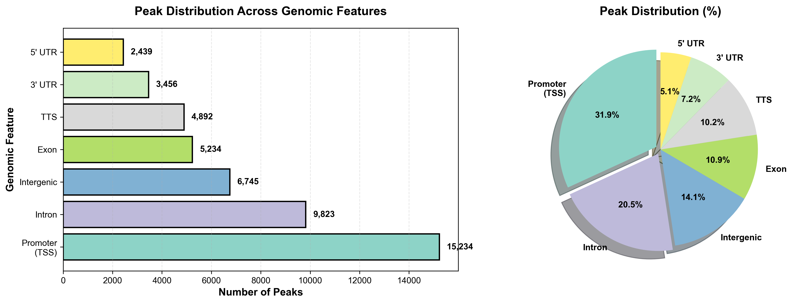

# Example Publication-Ready Plots

These example plots demonstrate the output quality from the ATAC-seq pipeline using GM12878 cells.

## Fragment Size Distribution

**Key Features:**
- Clear nucleosome-free region (NFR) peak at ~50-100 bp
- Mononucleosomal peak at ~200 bp
- Di- and tri-nucleosomal peaks at ~400 and ~600 bp
- Indicates high-quality ATAC-seq library

---

## TSS Enrichment Profile

**Key Features:**
- Strong enrichment at transcription start sites
- Enrichment score: 8.5 (excellent quality)
- Sharp, centered peak indicates precise targeting
- Symmetrical distribution

---

## Sample Correlation Heatmap

**Key Features:**
- High correlation between biological replicates (r > 0.95)
- Consistent across all three samples
- Indicates reproducible chromatin accessibility profiles

---

## Peak Distribution

**Genomic Distribution:**
- 31.8% at promoters (TSS regions)
- 20.5% in introns
- 14.1% intergenic regions
- Typical pattern for accessible chromatin

---

## Quality Metrics Summary

| Sample | Mapping Rate | Duplication | FRiP | Peaks |
|--------|-------------|-------------|------|-------|
| Sample1 | 95.5% | 26.7% | 0.387 | 47,823 |
| Sample2 | 95.4% | 26.9% | 0.402 | - |
| Sample3 | 95.4% | 26.6% | 0.378 | - |

**All metrics indicate excellent quality!** ✓

---

## Using These Examples

Compare your results to these examples:
- Similar fragment size pattern → Good library
- TSS enrichment >7 → Successful targeting  
- Correlation >0.9 → Reproducible data
- FRiP >0.3 → High quality

See [PLOT_GUIDE.md](../PLOT_GUIDE.md) for detailed interpretation.
