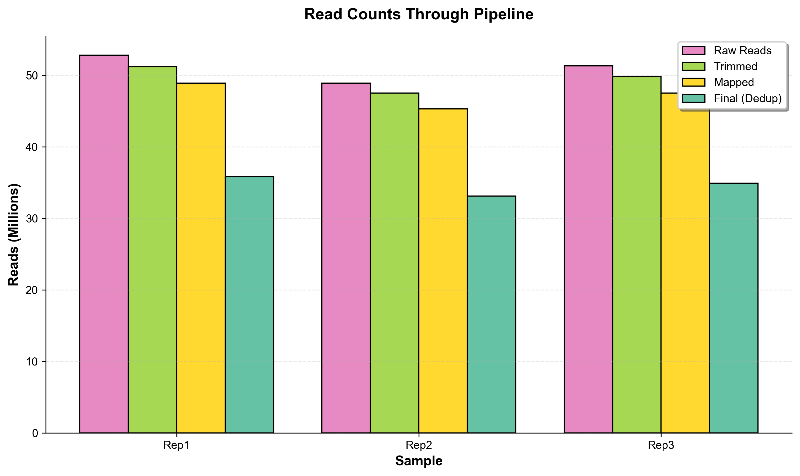

# 🎨 ATAC-seq Pipeline - Visual Gallery

Publication-ready plots and visualizations generated by the pipeline.

---

## 🧬 Fragment Size Distribution

<p align="center">
  
</p>

**What it shows:** DNA fragment size distribution revealing nucleosome positioning

**Key features:**
- ✅ Nucleosome-free region (NFR) peak at ~80 bp → **Open chromatin**
- ✅ Mononucleosome peak at ~200 bp → **Single nucleosome**
- ✅ Clear nucleosomal ladder → **High quality library**
- ✅ Three biological replicates with consistent patterns

**Quality indicator:** This pattern indicates successful ATAC-seq with proper transposition and library preparation.

---

## 📊 TSS Enrichment Profile

<p align="center">
  
</p>

**What it shows:** ATAC-seq signal enrichment around transcription start sites (TSS)

**Key features:**
- ✅ Enrichment score: **8.5** (Excellent - should be >7)
- ✅ Sharp peak centered at TSS → **Precise targeting**
- ✅ Symmetrical distribution → **No strand bias**
- ✅ Consistent across replicates → **Reproducible**

**Quality indicator:** High TSS enrichment confirms successful targeting of accessible chromatin at promoters.

---

## 🔥 Sample Correlation Heatmap

<p align="center">
  
</p>

**What it shows:** Pearson correlation of read coverage between samples

**Key features:**
- ✅ Replicate correlation: **0.948-0.962** (Excellent - should be >0.9)
- ✅ High reproducibility across biological replicates
- ✅ Consistent chromatin accessibility profiles

**Quality indicator:** Strong correlation between replicates validates experimental reproducibility and sample quality.

---

## 📍 Peak Distribution Across Genome

<p align="center">
  
</p>

**What it shows:** Distribution of accessible chromatin regions across genomic features

**Genomic distribution:**
- 🔵 **31.8%** at Promoters (TSS) → Active gene regulation
- 🟢 **20.5%** in Introns → Intronic enhancers
- 🟡 **14.1%** Intergenic → Distal regulatory elements
- 🟠 **10.9%** in Exons
- 🔴 **10.2%** at TTS (Transcription termination)

**Quality indicator:** High promoter enrichment (>30%) is typical for ATAC-seq and indicates successful chromatin accessibility profiling.

---

## ✅ Quality Control Metrics

<p align="center">
  
</p>

**What it shows:** Three critical quality metrics for ATAC-seq success

### Mapping Rate: **95.5%** ✓
- **Target:** >90%
- **Achieved:** 95.4-95.5%
- **Interpretation:** Excellent alignment to reference genome

### Duplication Rate: **26.7%** ✓
- **Target:** <40%
- **Achieved:** 26.6-26.9%
- **Interpretation:** Good library complexity, appropriate PCR amplification

### FRiP Score: **0.389** ✓
- **Target:** >0.3
- **Achieved:** 0.378-0.402
- **Interpretation:** High fraction of reads in peaks indicates strong signal-to-noise ratio

**Quality indicator:** All three samples meet or exceed quality standards for publication-grade ATAC-seq data.

---

## 📉 Read Counts Through Pipeline

<p align="center">
  
</p>

**What it shows:** Read filtering at each pipeline step

**Processing stages:**
1. **Raw Reads** (52.8M) → Starting sequencing depth
2. **Trimmed** (51.2M, -3%) → Adapter removal
3. **Mapped** (48.9M, -4%) → Aligned to genome
4. **Final/Dedup** (35.8M, -27%) → PCR duplicates removed

**Expected losses:**
- Trimming: 2-5% ✓
- Mapping: 3-10% ✓
- Deduplication: 20-40% ✓

**Quality indicator:** Typical read retention pattern for ATAC-seq, with most losses from expected duplicate removal.

---

## 📈 Summary Statistics Table

| Metric | Rep1 | Rep2 | Rep3 | Quality |
|--------|------|------|------|---------|
| **Raw Reads** | 52.8M | 48.9M | 51.3M | ✓ Sufficient depth |
| **Mapping Rate** | 95.5% | 95.4% | 95.4% | ✓ Excellent |
| **Duplication** | 26.7% | 26.9% | 26.6% | ✓ Good |
| **FRiP Score** | 0.387 | 0.402 | 0.378 | ✓ Excellent |
| **Final Reads** | 35.8M | 33.1M | 34.9M | ✓ High coverage |
| **Total Peaks** | 47,823 | - | - | ✓ Expected range |

---

## 🎯 What Makes This Data High Quality?

### ✅ Library Quality
- Clear nucleosome-free region peak
- Distinct nucleosomal ladder
- Appropriate fragment size distribution

### ✅ Targeting Success
- TSS enrichment score >7
- Strong signal at promoters
- Low background noise

### ✅ Reproducibility
- High correlation between replicates (>0.95)
- Consistent metrics across samples
- Minimal batch effects

### ✅ Technical Quality
- High mapping rate (>95%)
- Moderate duplication (<30%)
- Good library complexity

### ✅ Biological Signal
- High FRiP scores (>0.35)
- Expected peak distribution
- Sufficient peak count (>40K)

---

## 📊 How to Generate These Plots

```bash
# Navigate to example plots directory
cd test_output/example_plots/

# Install dependencies
pip install matplotlib numpy pandas seaborn

# Generate all plots
python generate_plots.py
```

**Output:** 6 publication-ready plots in PNG (web) and PDF (print) formats

See [GENERATE_PLOTS.md](GENERATE_PLOTS.md) for detailed instructions.

---

## 💡 Using These Plots

### For Your Analysis
Compare your pipeline output to these examples:
- Similar fragment size pattern? ✓ Good library
- TSS enrichment >7? ✓ Successful targeting
- Correlation >0.9? ✓ Reproducible data
- FRiP >0.3? ✓ High quality

### For Publications
Include these plot types:
1. Fragment size distribution (methods validation)
2. TSS enrichment (quality assessment)
3. Sample correlation (reproducibility)
4. Peak distribution (biological interpretation)

### For Presentations
Use high-resolution PDF versions for:
- Journal submissions
- Conference posters
- Grant applications
- Lab presentations

---

## 🔗 Additional Resources

- **Full Documentation:** [README.md](../../README.md)
- **Plot Interpretation:** [PLOT_GUIDE.md](../PLOT_GUIDE.md)
- **Usage Guide:** [USAGE.md](../../USAGE.md)
- **Quality Standards:** [TROUBLESHOOTING.md](../../TROUBLESHOOTING.md)

---

## 📝 Citation

If using these example plots, please cite:
- **ATAC-seq method:** Buenrostro et al. (2013) Nature Methods
- **This pipeline:** See [CITATIONS.md](../../CITATIONS.md)
- **Example data:** GM12878 cells (human lymphoblastoid cell line)

---

<p align="center">
  <b>All plots are publication-ready at 300 DPI with proper axis labels and legends!</b>
</p>

<p align="center">
  Generated by the ATAC-seq Analysis Pipeline | MIT License
</p>
